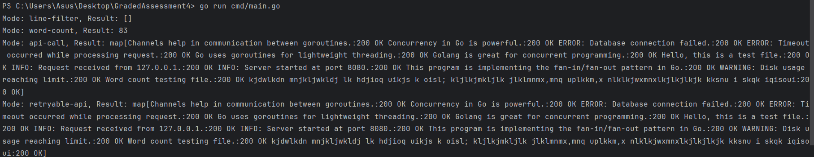

## In this code I have designed a **concurrent File Processor** with Fan-Out Pattern

The Program reads the lines from multiple .txt files in the directory and process them concurrently using fan-out concurrency pattern

Features:
1. The program accepts the directory path as input.
2. Scans the directory to find all the.txt files.
3. For each file it spawns the go routine to read lines parallel(fan-out).
4. Each line read sends to a channel for further processing(fan-in).
5. Depending on the mode selected by the user,  one of the following processing logics is applied:
   Line Filter: Forward only lines containing a specific keyword(eg. "error")
   Word Count : Count the total number of words across all teh lines.
   Api Call : Send each Line to an external Api(eg: httpbin.org/post) and collect teh response status.
   Retryable API call: Send each line to an API, but retry up to 3 times with backoff in case of failure.
6. Printing the result of Processing based on the selected mode.

# Workflow

1. File Reading:

The fileReader.ReadFiles function scans the directory (sampleTexts/) for .txt files.

Each file is read concurrently and its lines are sent to a lineChan channel.

2. Processing:

A for loop iterates over predefined modes (LINE_FILTER, WORD_COUNT, API_CALL, RETRYABLE_API).

If LINE_FILTER mode is used, it searches for the keyword "Error" in the lines.

The processor.ProcessLines function processes the lines based on the selected mode.

3. API Handling:

If the mode involves API calls, apiHandler.CallAPI or apiHandler.CallAPIWithRetry is invoked to send requests.

sendRequestWithRetry attempts retries with exponential backoff if the API fails.

4. Result Output:

The final processing result is printed after all files have been processed.

